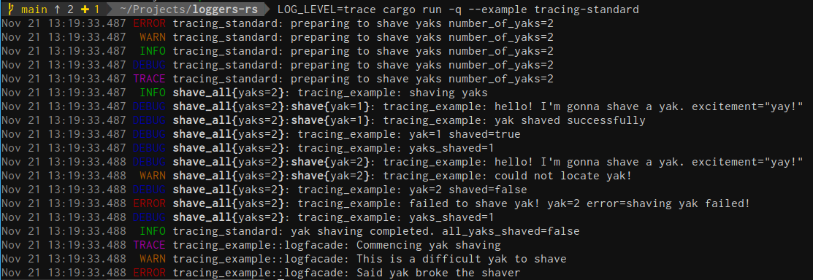

# tracing
Example usage of popular logger tracing

## Overview
At the time of writing this 11/21/2020 [tracing](https://github.com/tokio-rs/tracing) has 1.1k stars
and 183 forks which places it even ahead of the [rust-lang default offering](https://github.com/rust-lang/log)
and makes is the most popular logging crate in the Rust community.

***tracing*** is a framework for instrumenting Rust programs to collect **structured**,
**event-based**, diagnostic information. Applications need to us a collector implementation to
record the events from tracing.

References:
* [Why another logging library](https://tokio.rs/blog/2019-08-tracing)
* [Zero to Production and structured logging](https://www.lpalmieri.com/posts/2020-09-27-zero-to-production-4-are-we-observable-yet/#5-structured-logging)
* [log compatibility](https://docs.rs/tracing/0.1.21/tracing/index.html#log-compatibility)
* [Convert log records to tracing events](https://docs.rs/tracing-log/0.1.1/tracing_log/#convert-log-records-to-tracing-events)
* [Tracing Examples](https://github.com/tokio-rs/tracing/tree/master/examples/examples)
* [Tracing Feature flags](https://docs.rs/tracing/0.1.21/tracing/index.html#crate-feature-flags)

## Standard Logging Usage

### In Applications
This will setup logging for all threads

1. Add `tracing-subscriber` to your application `Cargo.toml`:
   ```toml
   [dependencies]
   tracing = "0.1"
   tracing-subscriber = "0.2"
   ```
2. Add the subscriber to your code:
   ```rust
   use std::env;
   use tracing_example;
   use tracing::{Level, error, warn, info, debug, trace};
   use tracing_subscriber;
   
   fn main() {
       // configure global collector based on the max level given in the env variable LOG_LEVEL
       let loglevel= match env::var("LOG_LEVEL") {
           Ok(val) => val.parse().unwrap_or(Level::INFO),
           Err(_e) => Level::INFO,
       };
       tracing_subscriber::fmt().with_max_level(loglevel).init();
   
       // including number_of_yaks in this way will add a structured field to the event
       // at the end using the variables name and value `number_of_yaks=2`
       let number_of_yaks = 2;
       error!(number_of_yaks, "preparing to shave yaks");
       warn!(number_of_yaks, "preparing to shave yaks");
       info!(number_of_yaks, "preparing to shave yaks");
       debug!(number_of_yaks, "preparing to shave yaks");
       trace!(number_of_yaks, "preparing to shave yaks");
   
       // structured field with name and value called out
       let number_shaved = tracing_example::shave_all(number_of_yaks);
       info!(all_yaks_shaved = number_shaved == number_of_yaks, "yak shaving completed.");
   
       // log facade example
       tracing_example::logfacade::shave_yak_facade();
   }
   ```



### Consuming log records as tracing events
Many existing crates that you will import will be using the venerable `log` facade to emit messages.
Capturing those messages as tracing events is automatically taken care of when using the
`tracing_subscriber::fmt()`.

* [tracing-subscriber includes tracing-log](https://github.com/tokio-rs/tracing/blob/b1baa6c2ef4877bd7f11de5991234fc81a025947/tracing-subscriber/Cargo.toml#L44)
* [tracing-subscriber enabled tracing-log by default](https://github.com/tokio-rs/tracing/blob/b1baa6c2ef4877bd7f11de5991234fc81a025947/tracing-subscriber/Cargo.toml#L26)

### In Libraries
